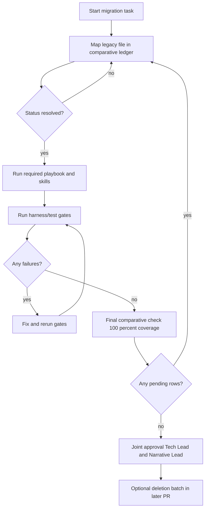

# Migration Approval Workflow

## State transitions

- `pending-decision` -> `historical` or `consolidated` or `kept`
- `pending-reconciliation` -> `superseded` or `kept`
- `pending-migration` -> `consolidated`

No transition to removal without joint approval.
